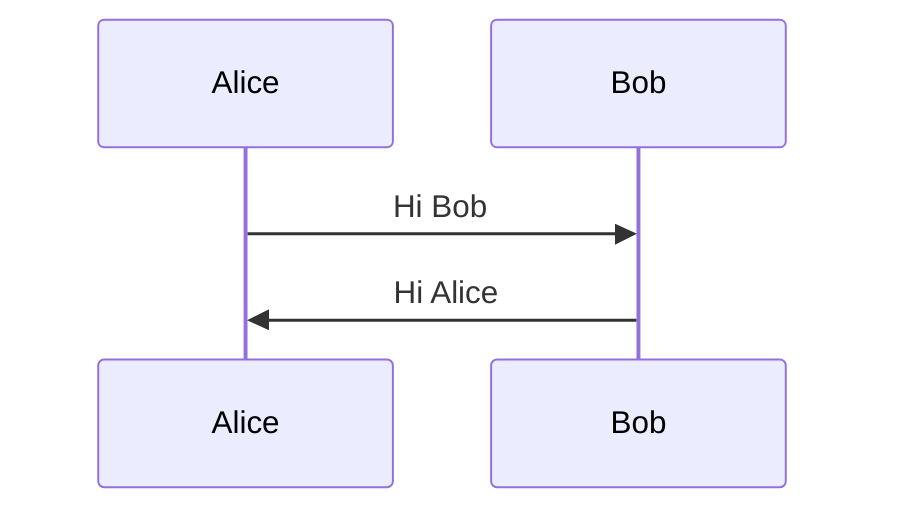

# run

- server
```
$ ros2 run screensaver_srv service 
```

- client

```
$ ros2 run screensaver_srv client
```
- launch

```
$ ros2 launch screensaver_srv screensaver.launch.py
```

# configure

$ ros2 param list
/screensaver_client_async:
  interval_camera_capture
  no_face_times
  use_sim_time
/screensaver_service:
  use_sim_time

$ ros2 param set /screensaver_client_async interval_camera_capture 3

# Design



# TODO
- [ ] run client asynchronously
- [ ] dockerize: how to run docker as a system service
- [ ] test coverage
- [ ] ci
- [x] add launch
- [X] how to handle control c in node
- [X] config file (e.g., THRESHOLD_NO_FACE = 5)


# docker issue

## colcon build in docker build

#0 1.843 Starting >>> lifemon_interfaces                                                                                                                                     
#0 2.039 --- stderr: lifemon_interfaces                                                                                                                                      
#0 2.039 CMake Error at CMakeLists.txt:9 (find_package):                          
#0 2.039   By not providing "Findament_cmake.cmake" in CMAKE_MODULE_PATH this project 
#0 2.039   has asked CMake to find a package configuration file provided by
#0 2.039   "ament_cmake", but CMake did not find one.                                 
#0 2.039                   
#0 2.039   Could not find a package configuration file provided by "ament_cmake" with
#0 2.039   any of the following names:
#0 2.039                                                                              
#0 2.039     ament_cmakeConfig.cmake                                                  
#0 2.039     ament_cmake-config.cmake                                                 
#0 2.039                                                                              
#0 2.039   Add the installation prefix of "ament_cmake" to CMAKE_PREFIX_PATH or set
#0 2.039   "ament_cmake_DIR" to a directory containing one of the above files.  If
#0 2.039   "ament_cmake" provides a separate development package or SDK, be sure it
#0 2.039   has been installed.                                                                                                                                               
#0 2.039                                  

## xset

https://stackoverflow.com/questions/54784133/how-to-turn-off-the-screen-from-a-docker-container
https://stackoverflow.com/questions/32163955/how-to-run-shell-script-on-host-from-docker-container

## open VIDEOIO(V4L2:/dev/video0): can't open camera by index
```
root@1bdaee5348a5:~/screensaver# ros2 launch screensaver_srv screensaver.launch.py 
[INFO] [launch]: All log files can be found below /root/.ros/log/2023-04-09-04-25-19-744922-1bdaee5348a5-992
[INFO] [launch]: Default logging verbosity is set to INFO
[INFO] [service-1]: process started with pid [993]
[INFO] [client-2]: process started with pid [995]
[client-2] [INFO] [1681014319.913335891] [screensaver_client_async]: no_face_times: 5
[client-2] [ WARN:0@0.294] global cap_v4l.cpp:982 open VIDEOIO(V4L2:/dev/video0): can't open camera by index
[client-2] [ WARN:0@0.294] global obsensor_stream_channel_v4l2.cpp:82 xioctl ioctl: fd=-1, req=-2140645888
```
## AttributeError: module '' has no attribute 'data'

```
(base) ykim@msi:~/devel/tmp/lifemon$ docker run --rm -it -v .:/root osrf/ros:humble-desktop bash -c "cd /root/screensaver && colcon build && . install/setup.bash && ros2 launch screensaver_srv screensaver.launch.py"
Starting >>> lifemon_interfaces
Finished <<< lifemon_interfaces [0.38s]                     
Starting >>> screensaver_srv
--- stderr: screensaver_srv                   
/usr/lib/python3/dist-packages/setuptools/command/install.py:34: SetuptoolsDeprecationWarning: setup.py install is deprecated. Use build and pip and other standards-based tools.
  warnings.warn(
---
Finished <<< screensaver_srv [0.46s]

Summary: 2 packages finished [0.91s]
  1 package had stderr output: screensaver_srv
[INFO] [launch]: All log files can be found below /root/.ros/log/2023-04-02-06-24-38-466033-e03248e83414-1
[INFO] [launch]: Default logging verbosity is set to INFO
[INFO] [service-1]: process started with pid [321]
[INFO] [client-2]: process started with pid [323]
[client-2] [INFO] [1680416678.801658416] [screensaver_client_async]: no_face_times: 5
[client-2] Traceback (most recent call last):
[client-2]   File "/root/screensaver/install/screensaver_srv/lib/screensaver_srv/client", line 33, in <module>
[client-2]     sys.exit(load_entry_point('screensaver-srv==0.1.0', 'console_scripts', 'client')())
[client-2]   File "/root/screensaver/install/screensaver_srv/lib/python3.10/site-packages/screensaver_srv/client_num_faces.py", line 41, in main
[client-2]     face_det = FaceDetection(screensaver_client.no_face_times)
[client-2]   File "/root/screensaver/install/screensaver_srv/lib/python3.10/site-packages/screensaver_srv/facedetcam.py", line 14, in __init__
[client-2]     .data.haarcascades + FACE_CASCADE_FILE
[client-2] AttributeError: module '' has no attribute 'data'
[ERROR] [client-2]: process has died [pid 323, exit code 1, cmd '/root/screensaver/install/screensaver_srv/lib/screensaver_srv/client --ros-args -r __node:=screensaver_client_async --params-file /tmp/launch_params_0eq7qz3i'].


^C[WARNING] [launch]: user interrupted with ctrl-c (SIGINT)
[INFO] [service-1]: process has finished cleanly [pid 321]

```

- https://github.com/DominikN/ros2_docker_examples
- https://www.allisonthackston.com/articles/vscode-docker-ros2.html

# parameters
- https://docs.ros.org/en/humble/Tutorials/Beginner-Client-Libraries/Using-Parameters-In-A-Class-Python.html
- https://roboticsbackend.com/rclpy-params-tutorial-get-set-ros2-params-with-python/
- https://roboticsbackend.com/ros2-yaml-params/

# ros2 issue

## 1. can't find xml file during build: 2023/03/18

ykim@msi:~/devel/lifemon/screensaver$ colcon build
...
--- stderr: screensaver_srv                   
error: package directory 'haarcascade_frontalface_default/xml' does not exist
...

- solution: https://roboticsbackend.com/create-a-ros2-python-package/ 

## 2. AttributeError: module '' has no attribute 'data'

- solution:
```
pip install opencv-contrib-python --upgrade 
```

## 3. Exception while calling service of node
```
ykim@msi:~/devel/lifemon/screensaver$ ros2 param list
Exception while calling service of node '/screensaver_client_async': None
/screensaver_service:
  use_sim_time
```
- solution:
```
Don't forget this:

. install/setup.bash
```
 
## python setup tool

SetuptoolsDeprecationWarning: setup.py install is deprecated. Use build and pip and other standards-based tools.

- solution
https://answers.ros.org/question/396439/setuptoolsdeprecationwarning-setuppy-install-is-deprecated-use-build-and-pip-and-other-standards-based-tools/